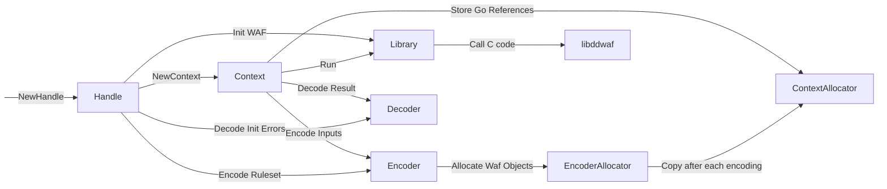

# go-libddwaf

This project's goal is to produce a higher level API for the go bindings to [libddwaf](https://github.com/DataDog/libddwaf): DataDog in-app WAF.
It consists of 2 separate entities: the bindings for the calls to libddwaf, and the encoder whose job is to convert _any_ go value to its libddwaf object representation.

An example usage would be:

```go
import waf "github.com/DataDog/go-libddwaf"

//go:embed
var ruleset []byte

func main() {
    var parsedRuleset any

    if err := json.Unmarshal(ruleset, &parsedRuleset); err != nil {
        return 1
    }

    wafHandle, err := waf.NewHandle(parsedRuleset, "", "")
    if err != nil {
        return 1
    }

    defer wafHandle.Close()

    wafCtx := wafHandle.NewContext()
    defer wafCtx.Close()

    matches, actions := wafCtx.Run(map[string]any{
        "server.request.path_params": "/rfiinc.txt",
    }, time.Minute)
}
```

The API documentation details can be found on [pkg.go.dev](https://pkg.go.dev/github.com/DataDog/go-libddwaf).

Originally this project was only here to provide CGO Wrappers to the calls to libddwaf.
But with the appearance of `ddwaf_object` tree like structure,
but also with the intention to build CGO-less bindings, this project size has grown to be a fully integrated brick in the DataDog tracer structure.
Which in turn made it necessary to document the project, to maintain it in an orderly fashion.

## Design

The WAF bindings have multiple moving parts that are necessary to understand:

- Handle: a object wrapper over the pointer to the C WAF Handle
- Context: a object wrapper over a pointer to the C WAF Context
- Encoder: whose goal is to construct a tree of Waf Objects to send to the WAF
- Allocator: Does all writing and allocation operations for the construction of Waf Objects
- Decoder: Transforms Waf Objects returned from the WAF to usual go objects (e.g. maps, arrays, ...)
- Library: The library which wraps all calls to C code



### Allocator

The cgoRefPool is a pure Go cgoRefPool of `ddwaf_object` C values on the Go memory heap.
the `cgoRefPool` go type is a way to make sure we can safely send go allocated data to the C side of the WAF
The main issue is the following: the `wafObject` uses a C union to store the tree structure of the full object,
union equivalent in go are interfaces and they are not compatible with C unions. The only way to be 100% sure
that the Go `wafObject` struct has the same layout as the C one is to only use primitive types. So the only way to
store a raw pointer is to use the `uintptr` type. But since `uintptr` do not have pointer semantics (and are just
basically integers), we need another structure to store the value as Go pointer because the GC is lurking. That's
where the `cgoRefPool` object comes into play: all new `wafObject` elements are created via this API whose especially
built to make sure there is no gap for the Garbage Collector to exploit. From there, since underlying values of the
`wafObject` are either arrays (for maps, structs and arrays) or string (for all ints, booleans and strings),
we can store 2 slices of arrays and use `runtime.KeepAlive` in each code path to protect them from the GC.

### Typical call to Run()

Here is an example of the flow of operations on a simple call to Run():

- Encode input data into Waf Objects
- Lock the context mutex until the end of the call
- Call `ddwaf_run`
- Decode the matches and actions

### CGO-less C Bindings

The main component used to build C bindings without using CGO is called [purego](https://github.com/ebitengine/purego). The flow of execution on our side is to embed the C shared library using `go:embed`. Then to dump it into a file, load it using `dlopen` and to load the symbols using `dlsym`. And finally to call them.

⚠️ Keep in mind that **purego only works on linux/darwin for amd64/arm64 and so does go-libddwaf.**

Another requirement of `libddwaf` is to have a FHS filesystem on your machine and, for linux, to provide `libc.so.6`, `libpthread.so.0` and `libm.so.6`, `libdl.so.2` as dynamic libraries.

## Contributing usual pitfalls

- Cannot dlopen twice in the app lifetime on OSX
- `runtime.KeepAlive()` calls are here to prevent the GC from destroying objects too early
- Since there is a stack switch between the go code and the C code, usually the only C stacktrace you will ever get is from gdb
- If a segfault happens during a call to the C code, the goroutine stacktrace which has done the call is the one annotated with `[syscall]`.
- [GoLand](https://www.jetbrains.com/go/) does not support `CGO_ENABLED=0` (as of June 2023)
- Keep in mind that we fully escape the type system. If you send the wrong data it will segfaults in the best cases but not always!
- The structs in `ctypes.go` are here to reproduce the memory layout of the structs in `include/ddwaf.h` because pointer to these structs will be passed directly.
- Do not use `uintptr` as function arguments or results types, coming from `unsafe.Pointer` casts of Go values, because they escape the pointer analysis which can create wrongly optimized code and crash. Pointer arithmetic is of course necessary in such a library but must be kept in the same function scope.
