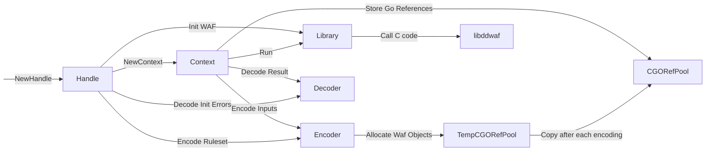

# go-libddwaf

This project's goal is to produce a higher level API for the go bindings to [libddwaf](https://github.com/DataDog/libddwaf): DataDog in-app WAF.
It consists of 2 separate entities: the bindings for the calls to libddwaf, and the encoder which job is to convert _any_ go value to its libddwaf object representation.

An example usage would be:

```go
import waf "github.com/DataDog/go-libddwaf/v3"

//go:embed
var ruleset []byte

func main() {
    var parsedRuleset any

    if err := json.Unmarshal(ruleset, &parsedRuleset); err != nil {
        panic(err)
    }

    wafHandle, err := waf.NewHandle(parsedRuleset, "", "")
    if err != nil {
        panic(err)
    }

    defer wafHandle.Close()

    wafCtx := wafHandle.NewContext()
    defer wafCtx.Close()

    matches, actions := wafCtx.Run(RunAddressData{
        Persistent: map[string]any{
            "server.request.path_params": "/rfiinc.txt",
        },
    })
}
```

The API documentation details can be found on [pkg.go.dev](https://pkg.go.dev/github.com/DataDog/go-libddwaf/v3).

Originally this project was only here to provide CGO Wrappers to the calls to libddwaf.
But with the appearance of `ddwaf_object` tree like structure,
but also with the intention to build CGO-less bindings, this project size has grown to be a fully integrated brick in the DataDog tracer structure.
Which in turn made it necessary to document the project, to maintain it in an orderly fashion.

## Supported platforms

This library currently support the following platform doublets:

| OS    | Arch    |
| ----- | ------- |
| Linux | amd64   |
| Linux | aarch64 |
| OSX   | amd64   |
| OSX   | arm64   |

This means that when the platform is not supported, top-level functions will return a `WafDisabledError` error including the purpose of it.

Note that:
* Linux support include for glibc and musl variants
* OSX under 10.9 is not supported
* A build tag named `datadog.no_waf` can be manually added to force the WAF to be disabled.

## Design

The WAF bindings have multiple moving parts that are necessary to understand:

- Handle: a object wrapper over the pointer to the C WAF Handle
- Context: a object wrapper over a pointer to the C WAF Context
- Encoder: its goal is to construct a tree of Waf Objects to send to the WAF
- CGORefPool: Does all allocation operations for the construction of Waf Objects and keeps track of the equivalent go pointers
- Decoder: Transforms Waf Objects returned from the WAF to usual go objects (e.g. maps, arrays, ...)
- Library: The low-level go bindings to the C library, providing improved typing



### CGO Reference Pool

The cgoRefPool type is a pure Go pointer pool of `ddwaf_object` C values on the Go memory heap.
the `cgoRefPool` go type is a way to make sure we can safely send Go allocated data to the C side of the WAF
The main issue is the following: the `WafObject` uses a C union to store the tree structure of the full object,
union equivalent in go are interfaces and they are not compatible with C unions. The only way to be 100% sure
that the Go `WafObject` struct has the same layout as the C one is to only use primitive types. So the only way to
store a raw pointer is to use the `uintptr` type. But since `uintptr` do not have pointer semantics (and are just
basically integers), we need another method to store the value as Go pointer because the GC will delete our data if it
is not referenced by Go pointers.

That's where the `cgoRefPool` object comes into play: all new `WafObject` elements are created via this API which is especially
built to make sure there is no gap for the Garbage Collector to exploit. From there, since underlying values of the
`wafObject` are either arrays of WafObjects (for maps, structs and arrays) or string (for all ints, booleans and strings),
we can store 2 slices of arrays and use `unsafe.KeepAlive` in each code path to protect them from the GC.

All these objects stored in the reference pool need to live throughout the use of the associated Waf Context.

### Typical call to Run()

Here is an example of the flow of operations on a simple call to Run():

- Encode input data into WAF Objects and store references in the temporary pool
- Lock the context mutex until the end of the call
- Store references from the temporary pool into the context level pool
- Call `ddwaf_run`
- Decode the matches and actions

### CGO-less C Bindings

This library uses [purego](https://github.com/ebitengine/purego) to implement C bindings without requiring use of CGO at compilation time. The high-level workflow
is to embed the C shared library using `go:embed`, dump it into a file, open the library using `dlopen`, load the
symbols using `dlsym`, and finally call them. On Linux systems, using `memfd_create(2)` enables the library to be loaded without
writing to the filesystem.

Another requirement of `libddwaf` is to have a FHS filesystem on your machine and, for Linux, to provide `libc.so.6`,
`libpthread.so.0`, and `libdl.so.2` as dynamic libraries.

> :warning: Keep in mind that **purego only works on linux/darwin for amd64/arm64 and so does go-libddwaf.**

## Contributing pitfalls

- Cannot dlopen twice in the app lifetime on OSX. It messes with Thread Local Storage and usually finishes with a `std::bad_alloc()`
- `keepAlive()` calls are here to prevent the GC from destroying objects too early
- Since there is a stack switch between the Go code and the C code, usually the only C stacktrace you will ever get is from GDB
- If a segfault happens during a call to the C code, the goroutine stacktrace which has done the call is the one annotated with `[syscall]`
- [GoLand](https://www.jetbrains.com/go/) does not support `CGO_ENABLED=0` (as of June 2023)
- Keep in mind that we fully escape the type system. If you send the wrong data it will segfault in the best cases but not always!
- The structs in `ctypes.go` are here to reproduce the memory layout of the structs in `include/ddwaf.h` because pointers to these structs will be passed directly
- Do not use `uintptr` as function arguments or results types, coming from `unsafe.Pointer` casts of Go values, because they escape the pointer analysis which can create wrongly optimized code and crash. Pointer arithmetic is of course necessary in such a library but must be kept in the same function scope.
- GDB is available on arm64 but is not officially supported so it usually crashes pretty fast (as of June 2023)
- No pointer to variables on the stack shall be sent to the C code because Go stacks can be moved during the C call. More on this [here](https://medium.com/@trinad536/escape-analysis-in-golang-fc81b78f3550)
