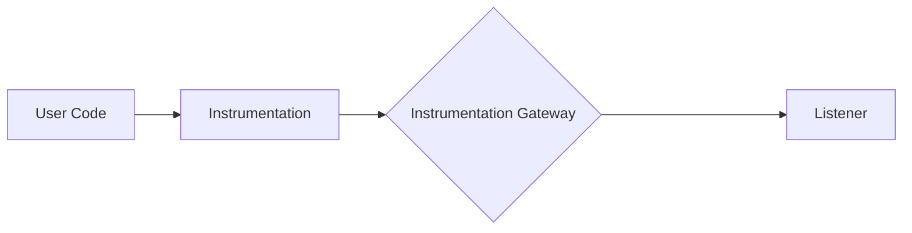
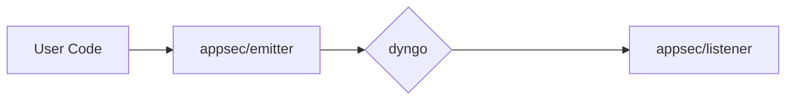

# Appsec Go Design

This document describes the design of the `internal/appsec` package and everything under it. This package is responsible
for securing the application by monitoring the operations that are executed by the application and applying actions in
case a security threats is detected.

Most of the work is to forward information to the module `github.com/DataDog/go-libddwaf` which contains the WAF
(Web Application Firewall) engine. The WAF does most of the decision making about events and actions. Our goal is to
connect the different parts of the application and the WAF engine while keeping up to date the various sources of
configuration that the WAF engine uses.

### Instrumentation Gateway: Dyngo

Having the customer (or orchestrion) instrument their code is the hardest part of the job. That's why we want to provide
the simplest API possible for them to use. This means loosing the flexibility or enabling and disabling multiple
products and features at runtime. Flexibility that we still want to provide to the customer, that's why behind every
API entrypoint present in `dd-trace-go/contrib` that support appsec is a call to the `internal/appsec/dyngo` package.



Dyngo is a context-scoped event listener system that provide a way to listen dynamically to events that are happening in
the customer code and to react to configuration changes and hot-swap event listeners at runtime.



### Operation definition requirements

* Each operation must have a `Start*` and a `Finish` method covering calls to dyngo.
* The content of the arguments and results should not require any external package, at most the standard library.

Example operation:

```go
package main

import (
	"context"

	"gopkg.in/DataDog/dd-trace-go.v1/internal/appsec/dyngo"
	"gopkg.in/DataDog/dd-trace-go.v1/internal/log"
)

type (
	ExampleOperation struct {
		dyngo.Operation
	}

	ExampleOperationArgs struct {
		Type string
	}

	ExampleOperationResult struct {
		Code int
	}
)

func (ExampleOperationArgs) IsArgOf(*ExampleOperation)      {}
func (ExampleOperationResult) IsResultOf(*ExampleOperation) {}

func StartExampleOperation(ctx context.Context, args ExampleOperationArgs) *ExampleOperation {
	parent, ok := dyngo.FromContext(ctx)
	if !ok {
		log.Error("No parent operation found")
		return nil
	}
	op := &ExampleOperation{
		Operation: dyngo.NewOperation(parent),
    }
	return dyngo.StartOperation(op, args)
}

func (op *ExampleOperation) Finish(result ExampleOperationResult) {
    dyngo.FinishOperation(op, result)
}
```

> [!CAUTION]
> Importing external packages in the operation definition will probably cause circular dependencies. This is because
> the operation definition can be used in the package is will instrument, and the package that will instrument it will
> probably import the operation definition.

### Operation Stack

Current state of the possible operation stacks


> [!IMPORTANT]
> Please note that this is how the operation SHOULD be stacked. If the user code does not have a Top Level Operation
> then nothing will be monitored. In this case an error log should be produced to explain thouroughly the issue to
> the user.
