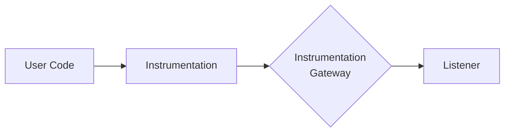
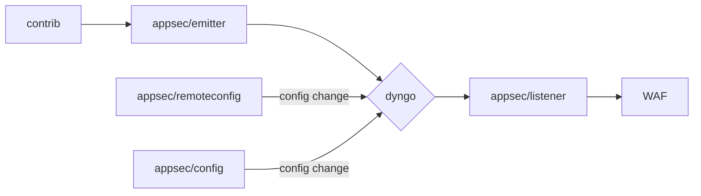
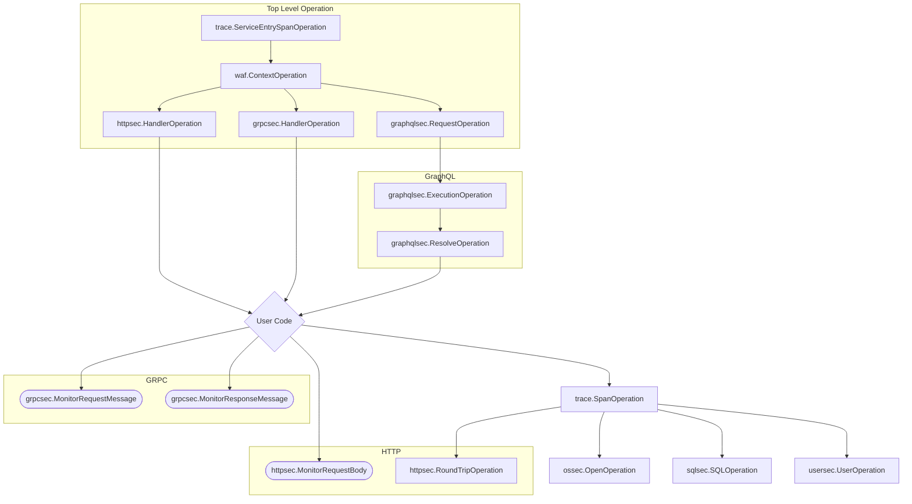
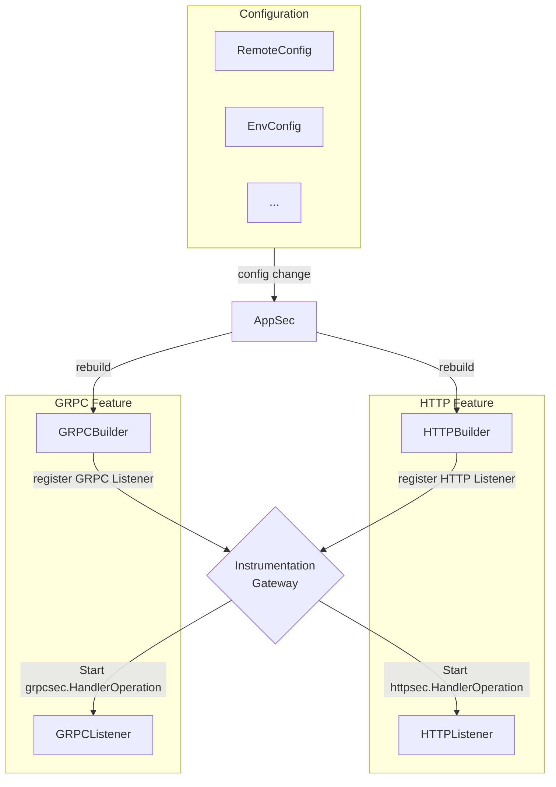

# Appsec Go Design

This document describes the design of the `internal/appsec` package and everything under it. This package is responsible
for securing the application by monitoring the operations that are executed by the application and applying actions in
case a security threats is detected.

Most of the work is to forward information to the module `github.com/DataDog/go-libddwaf` which contains the WAF
(Web Application Firewall) engine. The WAF does most of the decision making about events and actions. Our goal is to
connect the different parts of the application and the WAF engine while keeping up to date the various sources of
configuration that the WAF engine uses.

### Instrumentation Gateway: Dyngo

Having the customer (or orchestrion) instrument their code is the hardest part of the job. That's why we want to provide
the simplest API possible for them to use. This means loosing the flexibility or enabling and disabling multiple
products and features at runtime. Flexibility that we still want to provide to the customer, that's why behind every
API entrypoint present in `dd-trace-go/contrib` that support appsec is a call to the `internal/appsec/dyngo` package.



Dyngo is a context-scoped event listener system that provide a way to listen dynamically to events that are happening in
the customer code and to react to configuration changes and hot-swap event listeners at runtime.



### Operation definition requirements

* Each operation must have a `Start*` and a `Finish` method covering calls to dyngo.
* The content of the arguments and results should not require any external package, at most the standard library.

Example operation:

```go
package main

import (
	"context"

	"gopkg.in/DataDog/dd-trace-go.v1/internal/appsec/dyngo"
	"gopkg.in/DataDog/dd-trace-go.v1/internal/log"
)

type (
	ExampleOperation struct {
		dyngo.Operation
	}

	ExampleOperationArgs struct {
		Type string
	}

	ExampleOperationResult struct {
		Code int
	}
)

func (ExampleOperationArgs) IsArgOf(*ExampleOperation)      {}
func (ExampleOperationResult) IsResultOf(*ExampleOperation) {}

func StartExampleOperation(ctx context.Context, args ExampleOperationArgs) *ExampleOperation {
	parent, ok := dyngo.FromContext(ctx)
	if !ok {
		log.Error("No parent operation found")
		return nil
	}
	op := &ExampleOperation{
		Operation: dyngo.NewOperation(parent),
	}
	return dyngo.StartOperation(op, args)
}

func (op *ExampleOperation) Finish(result ExampleOperationResult) {
	dyngo.FinishOperation(op, result)
}
```

> [!CAUTION]
> Importing external packages in the operation definition will probably cause circular dependencies. This is because
> the operation definition can be used in the package is will instrument, and the package that will instrument it will
> probably import the operation definition.

### Operation Stack

Current state of the possible operation stacks



> [!IMPORTANT]
> Please note that this is how the operation SHOULD be stacked. If the user code does not have a Top Level Operation
> then nothing will be monitored. In this case an error log should be produced to explain thoroughly the issue to
> the user.

### Features

Features represent an abstract feature added to the tracer by AppSec. They are the bridge between the configuration and
its sources
and the actual code that needs to be ran in case of enablement or disablement of a feature. Features are divided in two
parts:

- The builder that should be a pure function that takes the configuration and returns a feature object.
- The listeners that are methods of the feature object that are called when an event from the Instrumentation Gateway is
  triggered.

From there, at each configuration change from any config source, the AppSec module will rebuild the feature objects,
register the listeners to the Instrumentation Gateway, and hot-swap the root level operation with the new one,
consequently making the whole AppSec code atomic.

Here is an example of how a system with only two features, GRPC and HTTP WAF Protection, would look like:



All currently available features are the following ones:

| Feature Name           | Description                                            |
|------------------------|--------------------------------------------------------|
| HTTP WAF Protection    | Protects HTTP requests from attacks                    |
| GRPC WAF Protection    | Protects GRPC requests from attacks                    |
| GraphQL WAF Protection | Protects GraphQL requests from attacks                 |
| SQL RASP               | Runtime Application Self-Protection for SQL injections |
| OS RASP                | Runtime Application Self-Protection for LFI attacks    |
| HTTP RASP              | Runtime Application Self-Protection for SSRF attacks   |
| User Security          | User blocking and login failures/success events        |
| WAF Context            | Setup of the request scoped context system of the WAF  |
| Tracing                | Bridge between the tracer and AppSec features          |
