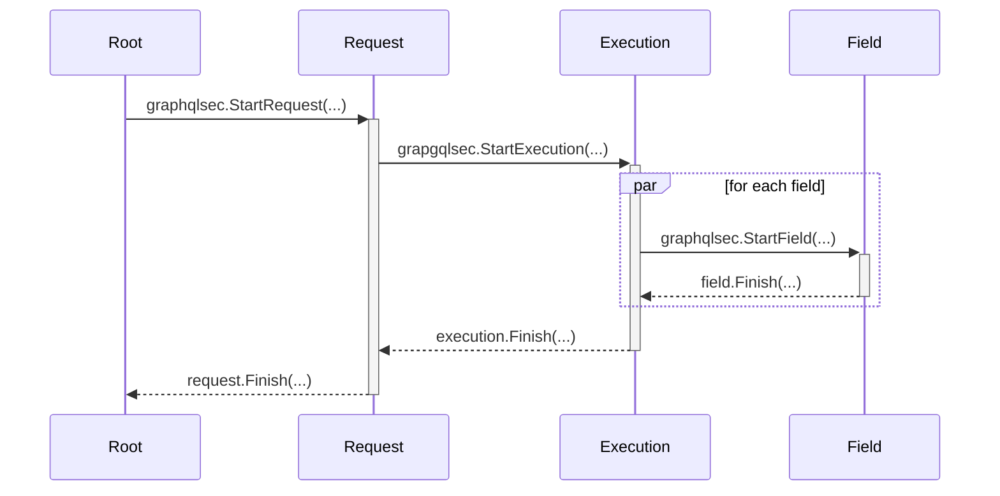

## GraphQL Threat Monitoring

This package provides `dyngo` support for GraphQL operations, which are listened
to according to the following sequence diagram:

```mermaid
sequenceDiagram
  participant Root
  participant Request
  participant Execution
  participant Field

  Root ->>+ Request: graphqlsec.StartRequest(...)

  Request ->>+ Execution: grapgqlsec.StartExecution(...)

  par for each field
  Execution ->>+ Field: graphqlsec.StartField(...)
  Field -->>- Execution: field.Finish(...)
  end

  Execution -->>- Request: execution.Finish(...)

  Request -->>- Root: request.Finish(...)
```
