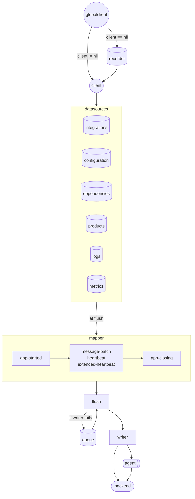

# Instrumentation Telemetry Client Architecture

This documentation details the current architecture of the Instrumentation Telemetry Client of dd-trace-go and was are its capabilities.
For an API documentation, please refer to the [api.go](https://github.com/DataDog/dd-trace-go/blob/main/internal/telemetry/api.go) file content.

Please, make sure to read the [Specification Documentation](https://github.com/DataDog/instrumentation-telemetry-api-docs/tree/main) before reading this document.

### Data Flow

### Low Level Components

- **`RingQueue[T]`**: The ring queue is an arbitrary data structure that support growing buffers, a buffer pool, and overflow. It is used as a backend data structure for the payload queue, the recorder and distribution metrics.
- **`Recorder[T]`**: The recorder is a `RingBuffer[func(T)]` that stores functions until the actual value `T` has been created when calling `Replay(T)` dequeues all functions from the recorder and applies them to the value `T`. By default, it can store 512 functions at most.
- **`Range[T]`**: Simple data structure that stores a start and end value, a minimum and maximum interval and has utils functions to help managing ranges.
- **`SyncMap[K, V]`**: Typed version of `sync.Map`
- **`SyncPool[T]`**: Typed version of `sync.Pool`

### High Level Components

- **GlobalClient**: The global client is a singleton that is used to access the client instance. It is used to create a new client instance if it does not exist yet. It is also used to access the client instance if it already exists. The global client recorder record calls to the clients until the `StartApp` function is called
- **Client**: The actual `Client` interface implementation. It's main job is to steer data to its corresponding data source. Other than that it actually manages the config of the client and gather data from the data sources to call `Flush` with it.
- **Data Sources**: Each data source implement the `dataSource` interface that has the method `Payload() transport.Payload` that is supposed to flush all data from the data source and make it into a payload ready to be serialized and sent to the backend.
  - **Integrations**: The integrations data source is responsible for creating the [`app-integrations-change`](https://github.com/DataDog/instrumentation-telemetry-api-docs/blob/main/GeneratedDocumentation/ApiDocs/v2/SchemaDocumentation/Schemas/app_integrations_change.md) payload. A very simple slice and mutex is used as backing store.
  - **Configuration**: The configuration data source is responsible for creating the [`app-client-configuration-change`](https://github.com/DataDog/instrumentation-telemetry-api-docs/blob/main/GeneratedDocumentation/ApiDocs/v2/SchemaDocumentation/Schemas/app_client_configuration_change.md) payload. A map and mutex is used as backing store.
  - **Dependencies**: The dependencies data source is responsible for gathering data [`app-dependencies-loaded`](https://github.com/DataDog/instrumentation-telemetry-api-docs/blob/main/GeneratedDocumentation/ApiDocs/v2/SchemaDocumentation/Schemas/app_dependencies_loaded.md) payload. No public API is available for this as this is does in-house with the `ClientConfig.DependencyLoader` function output.
  - **Product**: The product data source is responsible for gathering data [`app-product-change`](https://github.com/DataDog/instrumentation-telemetry-api-docs/blob/main/GeneratedDocumentation/ApiDocs/v2/SchemaDocumentation/Schemas/app_product_change.md) payload. A map and mutex is used as backing store.
  - **Metrics**: The metrics data source is responsible for gathering data for the [`generate-metrics`](https://github.com/DataDog/instrumentation-telemetry-api-docs/blob/main/GeneratedDocumentation/ApiDocs/v2/SchemaDocumentation/Schemas/generate_metrics.md) payload. A `SyncMap[metrickey, metricHandle]` is used as backing store. More on that in the metrics specific section
  - **Distributions**: The distributions data source is responsible for gathering data for the [`distributions`](https://github.com/DataDog/instrumentation-telemetry-api-docs/blob/main/GeneratedDocumentation/ApiDocs/v2/SchemaDocumentation/Schemas/distributions.md) payload. A `SyncMap[distributionkey, distributionHandle]` is used as backing store. More on that in the metrics specific section
  - **Logs**: The logs data source is responsible for gathering data for the [`generate-logs`](https://github.com/DataDog/instrumentation-telemetry-api-docs/blob/main/GeneratedDocumentation/ApiDocs/v2/SchemaDocumentation/Schemas/logs.md) payload. A `SyncMap[logkey, logValue]` is used as backing store. More on that in the logs specific section.
- **Mapper**: The mapper is also responsible for creating the `app-started`, `app-closing`, `heartbeat`, `extended-heartbeat` and `message-batch` payloads from the data sources that needs data from other payloads but not from the API user. The mapper already return another mapper that will be used in the next call to `Flush`.
- **Writer**: The writer is responsible for sending the payload to the backend. It is a simple interface that has a `Write` method that receives a `transport.Payload` and returns statistics about the write operation.
